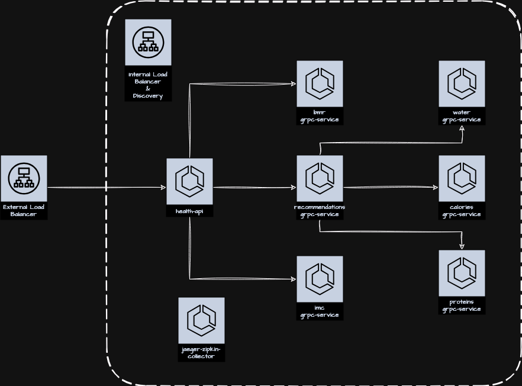

# Health API lab

Original code: [msfidelis/linuxtips-curso-containers-ecs-health-api-lab](https://github.com/msfidelis/linuxtips-curso-containers-ecs-health-api-lab/tree/aula/roteamento-avancado)

## Terraform apply

Create the file: `environment/dev/backend.tfvars`:

```tf
bucket         = "<tfstate bucket name>"
key            = "<tfstate bucket key>"
dynamodb_table = "<tfstate lock dynamodb table name>"
region         = "<bucket and dynamodb region>"
```

```bash
$ terraform init -backend-config=environment/dev/backend.tfvars
$ terraform validate
$ terraform plan
$ terraform apply
```

**Warning**: you cannot add existing services to Service Connect. You must first destroy them.


## [v1] - Internal and external routing

Create an environment with distributed communication between several internal and external microservices



```bash
$ export ALB_DNS=<your external ALB dns>

$ curl -s  -H "Host: health.linuxtips.demo" $ALB_DNS/version
{"application":"health-api","version":"v1"}

$ curl -s  -H "Host: health.linuxtips.demo" \
-H 'Content-Type: application/json' \
--data-raw '{ 
   "age": 26,
   "weight": 90.0,
   "height": 1.77,
   "gender": "M", 
   "activity_intensity": "very_active"
}' $ALB_DNS/calculator | jq .

{
  "id": "cc0af440-3f85-4f23-9909-da15015bc5ef",
  "status": 200,
  "imc": {
    "result": 28.72737719046251,
    "class": "overweight"
  },
  "basal": {
    "bmr": {
      "value": 2188.5,
      "unit": "kcal"
    },
    "necessity": {
      "value": 3775.1625000000004,
      "unit": "kcal"
    }
  },
  "health_info": {
    "age": 26,
    "weight": 90,
    "height": 1.77,
    "gender": "M",
    "activity_intensity": "very_active"
  },
  "recomendations": {
    "protein": {
      "value": 180,
      "unit": "kcal"
    },
    "water": {
      "value": 3150,
      "unit": "ml"
    },
    "calories": {
      "maintain_weight": {
        "value": 3775.1625000000004,
        "unit": "kcal"
      },
      "loss_weight": {
        "value": 3397.6462500000002,
        "unit": "kcal"
      },
      "gain_weight": {
        "value": 4907.71125,
        "unit": "kcal"
      }
    }
  }
}
```

## Terraform destroy

```bash
$ terraform destroy
$ rm -r .terraform.lock.hcl 
$ rm -rf .terraform
$ cd ../..
```
