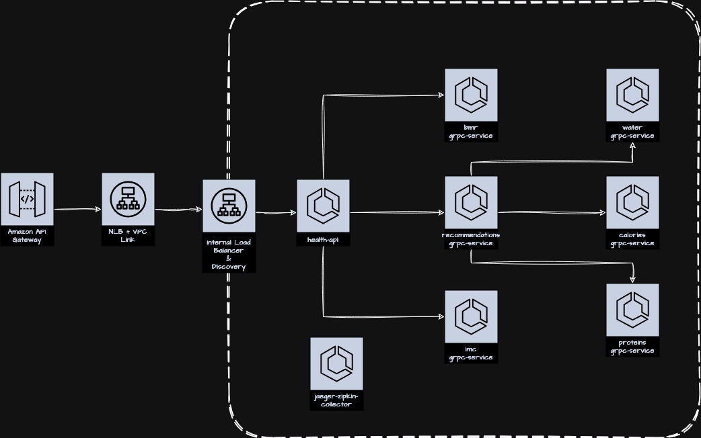

# Health API lab

Original code: [msfidelis/linuxtips-curso-containers-ecs-health-api-lab](https://github.com/msfidelis/linuxtips-curso-containers-ecs-health-api-lab/tree/aula/api-gateway)

## Terraform apply

```bash
$ terraform init -backend-config=environment/dev/backend.tfvars
$ terraform validate
$ terraform plan
$ terraform apply
```

**Warning**: 
* You cannot add existing services to Service Connect. You must first destroy them.
* on first services deployment, a `name resolver error` may happen in the task log. Re-deploy the service.

## [v2] - API Gateway and VPC Link for External Exposure

Create an environment with distributed communication between several internal and external microservices



```bash
$ curl -s  -X POST \
-H 'Content-Type: application/json' \
-H "x-api-key: $API_KEY" \
--data-raw '{ 
   "age": 26,
   "weight": 90.0,
   "height": 1.77,
   "gender": "M", 
   "activity_intensity": "very_active"
}' $API_URL/calculator | jq .

{
  "id": "fe53fcda-14e0-41b8-baf7-39d38d940989",
  "status": 200,
  "imc": {
    "result": 28.72737719046251,
    "class": "overweight"
  },
  "basal": {
    "bmr": {
      "value": 2188.5,
      "unit": "kcal"
    },
    "necessity": {
      "value": 3775.1625000000004,
      "unit": "kcal"
    }
  },
  "health_info": {
    "age": 26,
    "weight": 90,
    "height": 1.77,
    "gender": "M",
    "activity_intensity": "very_active"
  },
  "recomendations": {
    "protein": {
      "value": 180,
      "unit": "kcal"
    },
    "water": {
      "value": 3150,
      "unit": "ml"
    },
    "calories": {
      "maintain_weight": {
        "value": 3775.1625000000004,
        "unit": "kcal"
      },
      "loss_weight": {
        "value": 3397.6462500000002,
        "unit": "kcal"
      },
      "gain_weight": {
        "value": 4907.71125,
        "unit": "kcal"
      }
    }
  }
}
```

Testing usage plan limits:

```bash
$ while true
do
curl -s  -X POST \
-H 'Content-Type: application/json' \
-H "x-api-key: $API_KEY" \
--data-raw '{ 
   "age": 26,
   "weight": 90.0,
   "height": 1.77,
   "gender": "M", 
   "activity_intensity": "very_active"
}' $API_URL/calculator
echo    
done

{"id":"830e73d2-ab0c-47ba-b514-09358939d7ba","status":200,"imc":{"result":28.72737719046251,"class":"overweight"},"basal":{"bmr":{"value":2188.5,"unit":"kcal"},"necessity":{"value":3775.1625000000004,"unit":"kcal"}},"health_info":{"age":26,"weight":90,"height":1.77,"gender":"M","activity_intensity":"very_active"},"recomendations":{"protein":{"value":180,"unit":"kcal"},"water":{"value":3150,"unit":"ml"},"calories":{"maintain_weight":{"value":3775.1625000000004,"unit":"kcal"},"loss_weight":{"value":3397.6462500000002,"unit":"kcal"},"gain_weight":{"value":4907.71125,"unit":"kcal"}}}}
{"message":"Too Many Requests"}
{"id":"c8909ec4-9b82-4ceb-8dbe-eac8b7ca468b","status":200,"imc":{"result":28.72737719046251,"class":"overweight"},"basal":{"bmr":{"value":2188.5,"unit":"kcal"},"necessity":{"value":3775.1625000000004,"unit":"kcal"}},"health_info":{"age":26,"weight":90,"height":1.77,"gender":"M","activity_intensity":"very_active"},"recomendations":{"protein":{"value":180,"unit":"kcal"},"water":{"value":3150,"unit":"ml"},"calories":{"maintain_weight":{"value":3775.1625000000004,"unit":"kcal"},"loss_weight":{"value":3397.6462500000002,"unit":"kcal"},"gain_weight":{"value":4907.71125,"unit":"kcal"}}}}
{"message":"Too Many Requests"}
{"message":"Too Many Requests"}
```

Notice the message `Too Many Requests` due to rate limit.

## Terraform destroy

```bash
$ terraform destroy
$ rm -r .terraform.lock.hcl 
$ rm -rf .terraform
$ cd ../..
```
