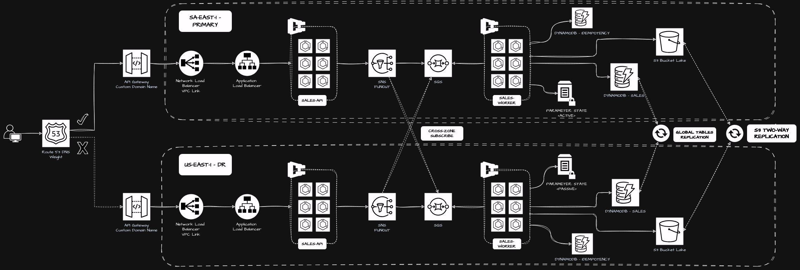

# ECS final project



## Local pipeline

Requirements:

* The [Task runner](https://taskfile.dev/)
* the `.env` file:

```bash
cat << EOT > .env
S3_BUCKET_NAME=<the tf state bucket name>
S3_BUCKET_REGION=<the tf state bucker region>
S3_KEY_ROOT_PATH=<the root folder in the tf state bucket>
DYNAMODB_TABLE_NAME=<the DynamoDB table used as lock file>
PROJECT_ENV=dev
YOUR_DOMAIN=<your Route53 public domain name>
YOUR_DOMAIN_HOSTED_ZONE_ID=<your Route53 public domain host id>
EOT
```

Deploy the ECS final project:

```bash
$ task create_multiregion
```


Destroy the ECS final project:

```bash
$ task destroy_multiregion
```

## Test Global Accelerator

```bash
export MY_DOMAIN=yourdomain.com

# New sale registration
curl -X POST https://sales.$MY_DOMAIN/sales -d '{"product":"The Little Prince", "amount": 14.00}' -i

export SALE_ID=<your sale id>

# Inquiring about a sale
curl -X GET https://sales.$MY_DOMAIN/sales/$SALE_ID -i

# Canceling a sale
curl -X DELETE https://sales.$MY_DOMAIN/sales/$SALE_ID  -i
```

## Test API Gateway

```bash
export MY_DOMAIN=yourdomain.com

# New sale registration
curl -X POST https://api.$MY_DOMAIN/sales -d '{"product":"The Little Prince", "amount": 14.00}' -i

export SALE_ID=<your sale id>

# Inquiring about a sale
curl -X GET https://api.$MY_DOMAIN/sales/$SALE_ID -i

# Canceling a sale
curl -X DELETE https://api.$MY_DOMAIN/sales/$SALE_ID  -i
```
