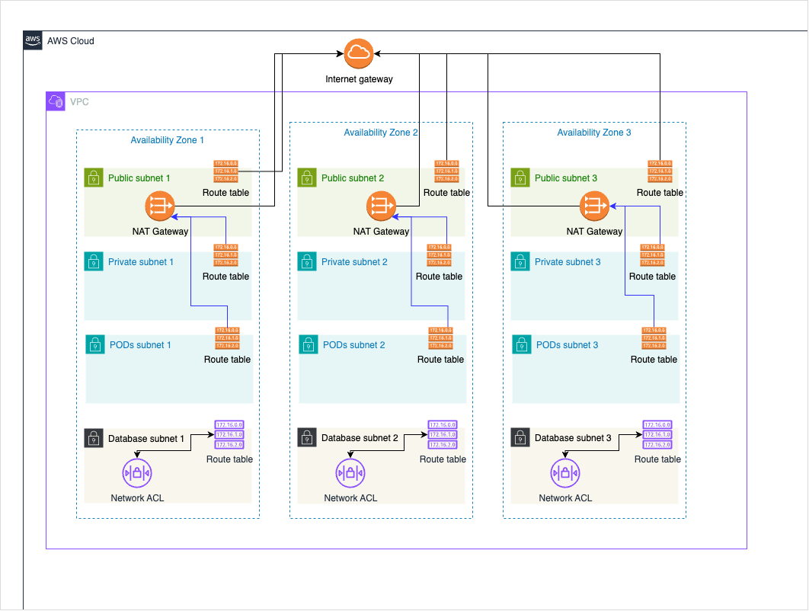

# Linuxtips course: Elastic Kubernetes Service - Overview, Inital setups and Networking



## VPC Networking

Create the files:
* `environment/dev/backend.tfvars`:
  ```tf
  bucket         = "<tfstate bucket name>"
  key            = "<tfstate bucket key>"
  dynamodb_table = "<tfstate lock dynamodb table name>"
  region         = "<bucket and dynamodb region>"
  ```
* `environment/dev/terraform.tfvars`:
  * your terraform variables values

Terraform:

```bash
$ terraform init -backend-config=environment/dev/backend.tfvars
$ terraform validate
$ terraform plan -var-file=environment/dev/terraform.tfvars
$ terraform apply -var-file=environment/dev/terraform.tfvars
```

Cleanup:

```bash
$ terraform destroy -var-file=environment/dev/terraform.tfvars
$ rm -r .terraform.lock.hcl 
$ rm -rf .terraform
```


## References

[IPv4 CIDR block association restrictions](https://docs.aws.amazon.com/vpc/latest/userguide/vpc-cidr-blocks.html#add-cidr-block-restrictions)
