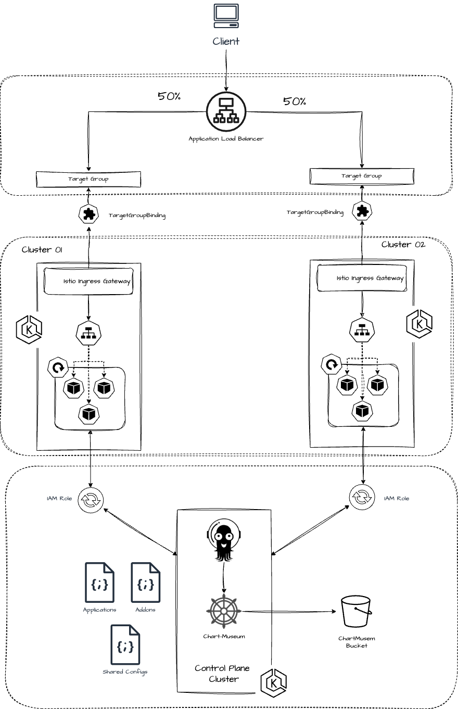

# Linuxtips course: Elastic Kubernetes Service - ArgoCD multiclusters management



Image credit: [Matheus Fidelis](https://github.com/msfidelis/linuxtips-curso-containers-aws-eks-multicluster-management)

## Requirements

* the [day 18](../day18/README.md) EKS networking

## Deploy shared load balancer

Create the files ( we are using [S3-native state locking](https://github.com/hashicorp/terraform/pull/35661) instead of DynamoDB table ):
* `terraform/shared-load-balancer/environment/dev/terraform.tfvars`:
  ```tf
  bucket         = "<tfstate bucket name>"
  key            = "<tfstate bucket key>"
  use_lockfile   = true
  region         = "<bucket region>"
  ```
* `terraform/shared-load-balancer/environment/dev/terraform.tfvars`

Terraform:

```bash
cd terraform/shared-load-balancer
export MY_WILDCARD_DOMAIN=<your wildcard domain> # *.mydomain.com
export MY_ROUTE53_HOSTED_ZONEID=<your route53 hosted zone id>
export TF_VAR_route53="{ dns_name = \"$MY_WILDCARD_DOMAIN$\", hosted_zone = \"$MY_ROUTE53_HOSTED_ZONEID\" }"
terraform init -backend-config=environment/dev/backend.tfvars
terraform validate
terraform plan -var-file=environment/dev/terraform.tfvars
terraform apply -var-file=environment/dev/terraform.tfvars
cd ../..
```

## Deploy eks clusters

Create the files ( we are using [S3-native state locking](https://github.com/hashicorp/terraform/pull/35661) instead of DynamoDB table ):
* `terraform/eks-cluster/environment/dev/terraform.tfvars`:
  ```tf
  bucket         = "<tfstate bucket name>"
  key            = "<tfstate bucket key>"
  use_lockfile   = true
  region         = "<bucket region>"
  ```
* `terraform/eks-cluster/environment/dev/terraform.tfvars`

Terraform:

```bash
cd terraform/eks-cluster
terraform init -backend-config=environment/dev/backend.tfvars
terraform validate
terraform plan -var-file=environment/dev/terraform.tfvars
terraform apply -var-file=environment/dev/terraform.tfvars
cd ../..
```

## Kubeconfig

```bash
aws eks update-kubeconfig --region us-east-1 --name linuxtips-cluster-01 --kubeconfig ~/.kube/linuxtips-cluster --alias linuxtips-cluster-01
aws eks update-kubeconfig --region us-east-1 --name linuxtips-cluster-02 --kubeconfig ~/.kube/linuxtips-cluster --alias linuxtips-cluster-02

export KUBECONFIG=~/.kube/linuxtips-cluster

kubectl --context linuxtips-cluster-01 cluster-info 
kubectl --context linuxtips-cluster-02 cluster-info 

kubectl --context linuxtips-cluster-01 get nodes -o wide
kubectl --context linuxtips-cluster-02 get nodes -o wide

helm list -n kube-system --kube-context linuxtips-cluster-01
helm list -n kube-system --kube-context linuxtips-cluster-02
```

## Cleanup

```bash
cd terraform/eks-cluster
terraform destroy -var-file=environment/dev/terraform.tfvars
rm -r .terraform.lock.hcl 
rm -rf .terraform
cd ../..
rm ~/.kube/linuxtips-cluster
```

```bash
cd terraform/shared-load-balancer
terraform destroy -var-file=environment/dev/terraform.tfvars
rm -r .terraform.lock.hcl 
rm -rf .terraform
cd ../..
```

Remove log groups from CloudWatch:

```bash
export EKS_NAME=`grep project_name terraform/eks-cluster/environment/dev/terraform.tfvars | cut -d"=" -f 2 | sed 's/[" ]//g'`
aws logs describe-log-groups --log-group-name-pattern $EKS_NAME --query 'logGroups[*].logGroupName' --output json | jq -r '.[]' |
while read LOG
do
  aws logs delete-log-group --log-group-name $LOG
done
```

Remove the [day 18](../day18/README.md) EKS networking
