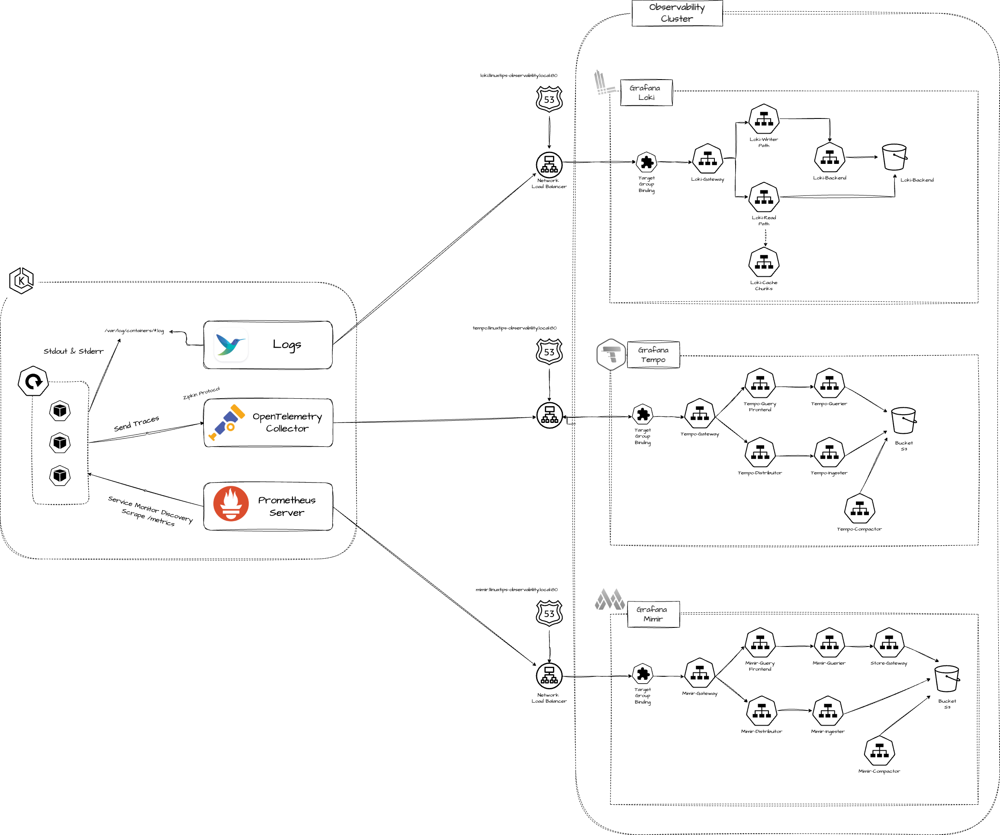
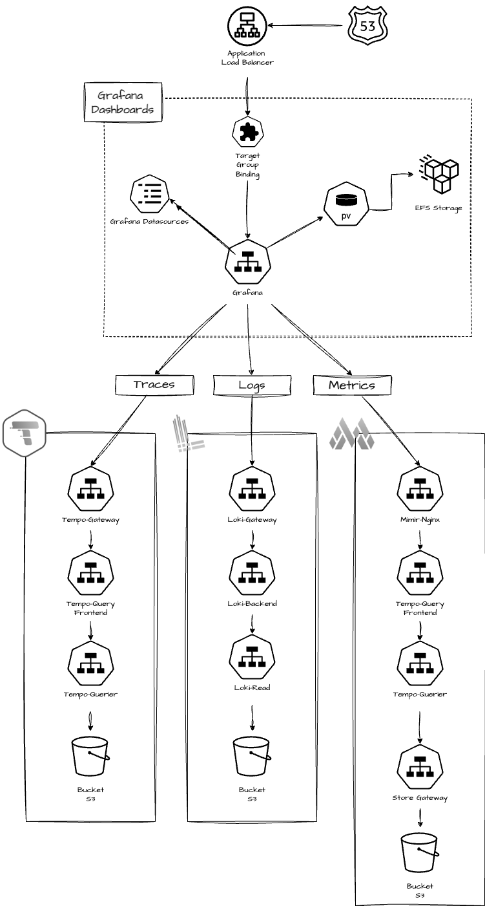

# Linuxtips course: Elastic Kubernetes Service - Observability cluster





Images credits: [Matheus Fidelis](https://github.com/msfidelis/linuxtips-curso-containers-aws-eks-observability-cluster)

## Requirements

* the [day 18](../day18/README.md) EKS networking
* the [day 35](../day35/README.md#cleanup) EKSs and Shared Load Balancer

## Deploy the EKS observability cluster

Create the files ( we are using [S3-native state locking](https://github.com/hashicorp/terraform/pull/35661) instead of DynamoDB table ):
* `terraform/eks-observability/environment/dev/terraform.tfvars`:
  ```tf
  bucket         = "<tfstate bucket name>"
  key            = "<tfstate bucket key>"
  use_lockfile   = true
  region         = "<bucket region>"
  ```
* `terraform/eks-observability/environment/dev/terraform.tfvars`

Terraform:

```bash
cd terraform/eks-observability
export MY_WILDCARD_DOMAIN=<your wildcard domain> # *.mydomain.com
export MY_ROUTE53_HOSTED_ZONEID=<your route53 hosted zone id>
export TF_VAR_route53="{ dns_name = \"$MY_WILDCARD_DOMAIN$\", hosted_zone = \"$MY_ROUTE53_HOSTED_ZONEID\" }"
terraform init -backend-config=environment/dev/backend.tfvars
terraform validate
terraform plan -var-file=environment/dev/terraform.tfvars
terraform apply -var-file=environment/dev/terraform.tfvars
cd ../..
```
## Kubeconfig

```bash
aws eks update-kubeconfig --region us-east-1 --name linuxtips-observability --kubeconfig ~/.kube/linuxtips-cluster --alias linuxtips-observability
export KUBECONFIG=~/.kube/linuxtips-cluster

helm list -A --kube-context linuxtips-observability
```

## Send log to Loki

Inside the bastion vm:

```bash
curl -s curl http://loki.linuxtips-observability.local && echo
OK
```

Epoch value is a Unix timestamp in nanoseconds.

```bash
export TS=`date +%s%N` # current epoch in nanoseconds
curl -H "Content-Type: application/json" -s -X POST "http://loki.linuxtips-observability.local/loki/api/v1/push" \
  --data-raw '{"streams": [{ "stream": { "foo": "bar2" }, "values": [ [ "'$TS'", "fizzbuzzzz" ] ] }]}'
```

Using the Grafana expolore query the loki with `{foo="bar2"}`

Generate more random logs

```bash
while true
do
  export TS=`date +%s%N`
  export VALUE=`tr -dc A-Za-z0-9 </dev/urandom | head -c 13; echo`
  curl -H "Content-Type: application/json" -s -X POST "http://loki.linuxtips-observability.local/loki/api/v1/push" \
    --data-raw "{\"streams\": [{ \"stream\": { \"foo\": \"bar2\" }, \"values\": [ [ \"$TS\", \"$VALUE\" ] ] }]}"
  sleep 1
done
```

## Health API app

Deploy:

```bash
export MY_DOMAIN=`echo $MY_WILDCARD_DOMAIN | sed 's/*.//'`
cat health-api-applicationset.yml | sed "s/yourdomain.com/$MY_DOMAIN/" | kubectl --context linuxtips-control-plane -n argocd apply -f -
```

Generate traces:

```bash
export HEALTH_API_DOMAIN="health.`echo $MY_WILDCARD_DOMAIN | sed 's/*.//'`"
while true
do
  curl -s  -X POST \
  -H 'Content-Type: application/json' \
  --data-raw '{ 
    "age": 26,
    "weight": 90.0,
    "height": 1.77,
    "gender": "M", 
    "activity_intensity": "very_active"
  }' https://$HEALTH_API_DOMAIN/calculator
  echo
done
```

## Cleanup

```bash
helm uninstall loki -n loki --kube-context linuxtips-observability && kubectl --context linuxtips-observability delete ns loki
helm uninstall mimir -n mimir --kube-context linuxtips-observability && kubectl --context linuxtips-observability delete ns mimir
helm uninstall tempo -n tempo --kube-context linuxtips-observability && kubectl --context linuxtips-observability delete ns tempo
helm uninstall grafana -n grafana --kube-context linuxtips-observability && kubectl --context linuxtips-observability delete ns grafana
```

Cleanup Health API app:

```bash
cat health-api-applicationset.yml | sed "s/yourdomain.com/$MY_DOMAIN/" | kubectl --context linuxtips-control-plane -n argocd delete -f -
```

Cleanup EKS observability:

```bash
cd terraform/eks-observability
terraform destroy -var-file=environment/dev/terraform.tfvars
rm -r .terraform.lock.hcl 
rm -rf .terraform
cd ../..
```

Remove log groups from CloudWatch:

```bash
export EKS_NAME=`grep project_name terraform/eks-observability/environment/dev/terraform.tfvars | cut -d"=" -f 2 | sed 's/[" ]//g'`
aws logs describe-log-groups --log-group-name-pattern $EKS_NAME --query 'logGroups[*].logGroupName' --output json | jq -r '.[]' |
while read LOG
do
  aws logs delete-log-group --log-group-name $LOG
done
```

Remove the [day 35](../day35/README.md#cleanup) EKSs and Shared Load Balancer

Remove the [day 18](../day18/README.md) EKS networking

## References

[Loki HTTP API](https://grafana.com/docs/loki/latest/reference/loki-http-api/)

[Loki simple scalable deployment](https://grafana.com/docs/loki/latest/get-started/deployment-modes/#simple-scalable)

[Loki: install the simple scalable Helm chart](https://grafana.com/docs/loki/latest/setup/install/helm/install-scalable/)

[Manage varying workloads at scale with autoscaling queriers](https://grafana.com/docs/loki/latest/operations/autoscaling_queriers/)

[How to autoscale Grafana Loki queries using KEDA](https://grafana.com/blog/2022/10/20/how-to-autoscale-grafana-loki-queries-using-keda/)

[Grafana Tempo distributed](https://github.com/grafana/helm-charts/tree/main/charts/tempo-distributed)

[Deploy Mimir with Helm](https://grafana.com/docs/mimir/latest/set-up/helm-chart/)

[How to Set Up Grafana Mimir in Kubernetese ?](https://medium.com/@MadhavPrajapati/how-to-set-up-grafana-mimir-in-kubernetese-207b8693d1b5)

[PersistentVolumeClaim retention](https://kubernetes.io/docs/concepts/workloads/controllers/statefulset/#persistentvolumeclaim-retention)

[Kubernetes StatefulSet PVC Deletion: Simplifying Cleanup with the whenDeleted Option](https://medium.com/@radharamadoss/kubernetes-statefulset-pvc-deletion-simplifying-cleanup-with-the-whendeleted-option-79ba3238ec2e)

# Tip

Remove the secret `sh.helm.release.v1.*.v1` before deploy again the same helm release. Example:

```bash
kubectl -n mimir delete secret sh.helm.release.v1.mimir.v1
```
